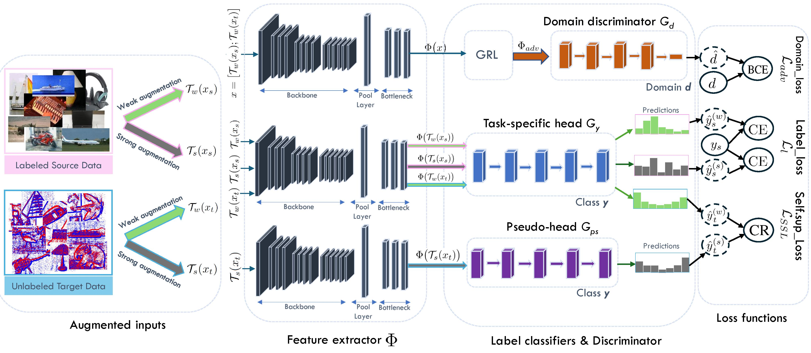

# ADA-SSR

Official implementation of **ADA-SSR: Adversarial Domain Adaptation and Self-supervised Refinement for RGB-to-Event Transfer**.

## Overview

ADA-SSR is an unsupervised domain adaptation framework that combines adversarial domain alignment with self-supervised refinement in the unlabeled
target domain.

<p align="center">
  
</p>

<p align="center">
  <em>Overview of the proposed ADA-SSR framework.</em>
</p>

## Data Preparation

Organize each dataset using the following structure:

```text
dataset_root/
├── source_train/
├── source_test/
├── target_train/
├── target_test/
└── image_list/
    ├── source_train.txt
    ├── source_test.txt
    ├── target_train.txt
    └── target_test.txt
